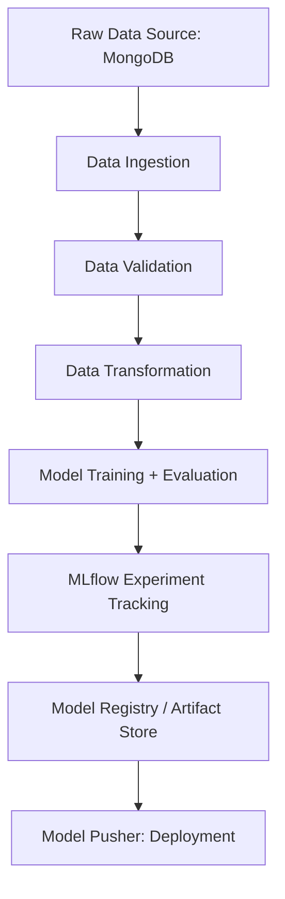

# 🚀 End-to-End Machine Learning Project

This repository contains a **complete MLOps pipeline** implemented from scratch, covering everything from **project setup** to **model deployment**. It follows an **industry-standard modular structure** to ensure scalability, reproducibility, and maintainability.

---

## 📑 Table of Contents

1. [Project Overview](#-project-overview)
2. [Architecture](#-architecture)
3. [Project Setup](#-project-setup)
4. [Data Ingestion](#-data-ingestion)
5. [Data Validation](#-data-validation)
6. [Data Transformation](#-data-transformation)
7. [Model Training & Evaluation](#-model-training--evaluation)
8. [Experiment Tracking (MLflow)](#-experiment-tracking-mlflow)
9. [Model Pusher (Deployment)](#-model-pusher-deployment)
10. [Logging & Exception Handling](#-logging--exception-handling)
11. [Packaging & Setup](#-packaging--setup)
12. [How to Run the Pipeline](#-how-to-run-the-pipeline)
13. [Future Enhancements](#-future-enhancements)

---

## 📌 Project Overview

The goal of this project is to build a **modular ML system** that can:

* Ingest data from external sources (MongoDB).
* Validate and clean the data.
* Transform features for modeling.
* Train multiple ML algorithms with hyperparameter tuning.
* Track experiments using **MLflow**.
* Deploy the best-performing model into production.

---

## 🏗 Architecture



---

## ⚙️ Project Setup

* **Environment Setup**: Created a virtual environment and installed dependencies.
* **Project Structure**: Designed modular folders (`src/`, `configs/`, `artifacts/`).
* **Version Control**: Initialized GitHub repository with `.gitignore`.
* **Environment Variables**: Managed using `.env` file and config classes.

---

## 📥 Data Ingestion

* **Source**: Data pulled from **MongoDB Atlas**.
* **Steps**:

  1. Connect to MongoDB collection.
  2. Extract raw data into local **feature store**.
  3. Perform **train-test split** and save in `artifacts/data_ingestion/`.
* **Artifacts**:

  * `feature_store.csv`
  * `train.csv`
  * `test.csv`

---

## ✅ Data Validation

* **Purpose**: Ensure data quality before transformation.
* **Checks Performed**:

  * Schema validation.
  * Null value checks.
  * Duplicates and data drift checks.
* **Artifacts**:

  * `data_validation_report.json`

---

## 🔄 Data Transformation

* **Techniques**:

  * Imputation for missing values.
  * Standardization / Normalization.
  * Encoding categorical features.
* **Pipeline**: Created a **preprocessor object (pickle file)** for consistency.
* **Artifacts**:

  * `preprocessor.pkl`
  * Transformed train/test sets

---

## 🤖 Model Training & Evaluation

* **Algorithms Used**: Multiple ML models tested (RandomForest, XGBoost, etc.).
* **Hyperparameter Tuning**: GridSearch/RandomizedSearch applied.
* **Evaluation Metrics**: Accuracy, Precision, Recall, F1-score.
* **Artifacts**:

  * `model.pkl`
  * Training logs & evaluation report

---

## 📊 Experiment Tracking (MLflow)

* **MLflow Integration**: Tracked metrics, parameters, and artifacts.
* **Remote Tracking**: Configured with **Dagshub MLflow Server**.
* **Benefits**:

  * Compare experiments.
  * Reproduce results easily.
  * Store best-performing models in a registry.

---

## 🚀 Model Pusher (Deployment)

* **Purpose**: Push final trained model to production-ready environment.
* **Steps**:

  * Copy `model.pkl` & `preprocessor.pkl` into `saved_models/`.
  * Optionally, upload to S3 bucket or cloud registry.
* **Artifacts**:

  * `saved_models/` (latest model + preprocessor).

---

## 📝 Logging & Exception Handling

* **Logging**: Implemented with Python `logging` module.
* **Error Handling**: Centralized exception handling for each pipeline stage.
* **Artifacts**:

  * `logs/app.log`

---

## 📦 Packaging & Setup

* **Setup Script**: Created `setup.py` for packaging.
* **Editable Installation**: Allows local development with `pip install -e .`.
* **Dependencies**: Managed via `requirements.txt`.

---

## ▶️ How to Run the Pipeline

1. Clone the repo:

   ```bash
   git clone <repo_url>
   cd project_folder
   ```
2. Install dependencies:

   ```bash
   pip install -r requirements.txt
   ```
3. Run training pipeline:

   ```bash
   python main.py
   ```
4. Check MLflow dashboard for experiments:

   ```bash
   mlflow ui
   ```

---

## 🚀 Future Enhancements

* Integrate **CI/CD** with GitHub Actions.
* Add **Docker & Kubernetes** deployment.
* Implement **Monitoring & Alerts** for model performance drift.
* Scale pipeline with **Apache Airflow** orchestration.

